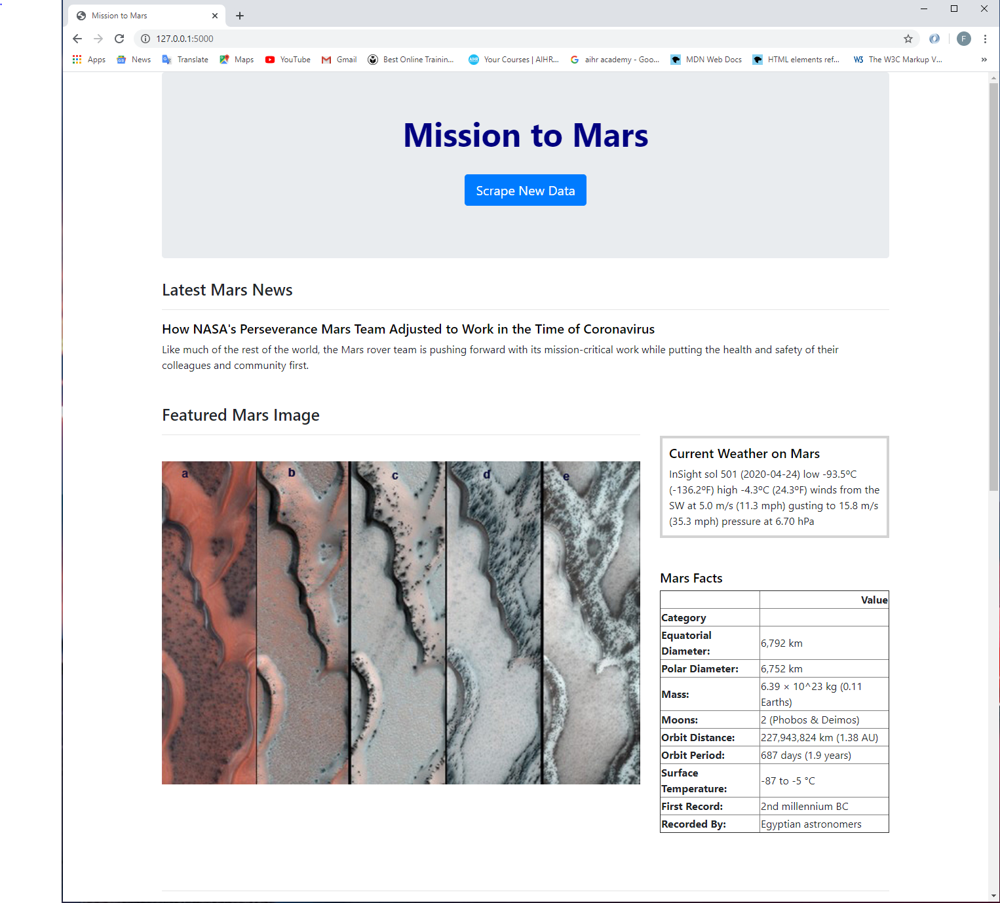
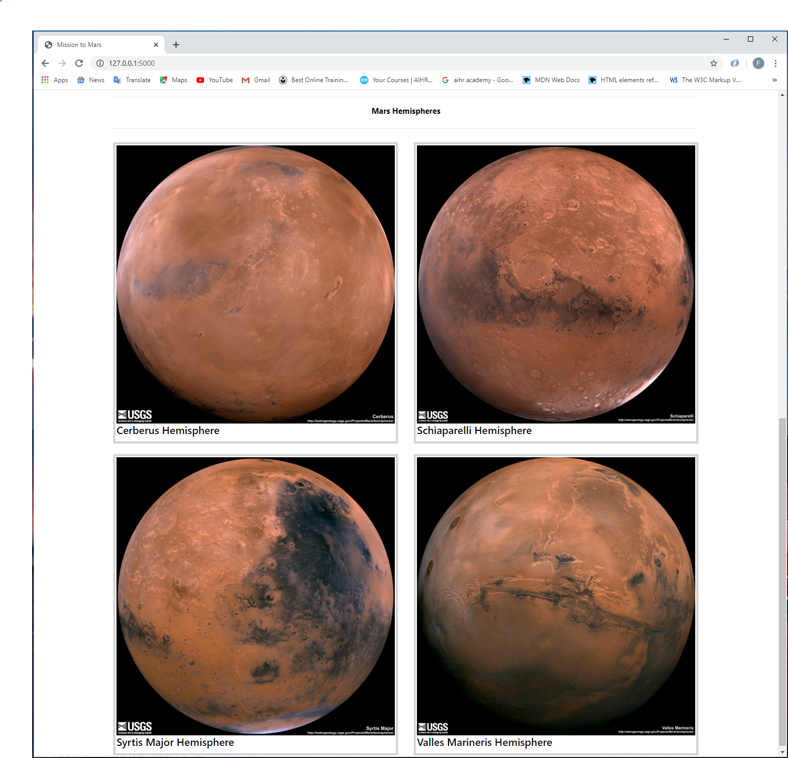

# Web-Scraping Exercise:

## This repository contains the files regarding a web-scraping exercise.
This folder contains the following:
 
1 Jupyter Notebook file called mission_to_mars.ipynb.
 
2 Python files called scrape_mars.py and app.py.
 
1 folder called Templates that contains an HTML file called index.html.
 
1 folder called Output that contains 6 text files generated from the jupyter notebook file that were used to analyze the HTML extracted from different websites, and 1 HTML file generated from the jupyter notebook file. 
 
2 screenshots of the final website.

## WEB SCRAPING:
We created a jupyter notebook file and used Beautiful Soup, Splinter and Pandas to scrape data from the following 5 websites:

### NASA Mars News Website: 
https://mars.nasa.gov/news 
 
We scraped this website and extracted the title and the description paragraph of the latest Mars news article.

### JPL Mars Space Image Website: 
https://www.jpl.nasa.gov/spaceimages/?search=&category=Mars 
 
We scraped this website and extracted the image url for the current featured Mars image.

### Mars Twitter Page: 
https://twitter.com/marswxreport?lang=en 
 
We scraped this website and extracted the latest Mars weather tweet. 

### Mars Facts Website: 
https://space-facts.com/mars/
 
We scraped this website and extracted a table containing facts about Mars such as the planet’s diameter, mass, etc.

### Mars Hemispheres Website: 
https://astrogeology.usgs.gov/search/results?q=hemisphere+enhanced&k1=target&v1=Mars 
 
We scraped this website and extracted the title and the full resolution image for each of Mars’s hemispheres. 

## CREATION OF A SCRAPING FUNCTION AND A WEB-PAGE TO DISPLAY THE RESULTS:

### Creation of a file with a “scrape” function:
We then created a new file called scrape_mars.py.
 
In this file, we created a function called "scrape" that incorporates all the logic from the jupyter notebook file to scrape the details from the 5 websites mentioned above.

### Creation of an html file:
We then created an html file called index.html to display the results returned from running the scrape function mentioned above. This html file divides the webpage into 5 distinct sections:
 
•	Top Section: 
 
This contains the website heading and also a button linked to the scrape function. A user can click this button and that will scrape the data from the 5 websites.
 
•	Middle Section - 1:
 
This contains the title and a description paragraph of the latest Mars news article from the NASA website.
 
•	Middle Section – 2 - Left:
 
This contains the current featured image from the JPL Mars Space Image Website.
 
•	Middle Section – 2 - Right:
 
This contains the latest Mars weather tweet from the Mars weather twitter account.
 
This also contains facts about Mars such as the planet’s diameter, mass, etc.
 
•	Bottom Section – 1:
 
This contains a heading for the section on the Mars Hemispheres.
 
•	Bottom Section – 2:
 
This contains the full resolution images of the 4 Mars hemispheres.

### Creation of an “app” file:
We then created a new file called app.py.
 
In this file we import (as a module) the scrape_mars.py file which contains the “scrape” function.
 
We then use the render template module to link the html file to the results from running the scrape function, so that we can display the results on a webpage using the template provided by the html file.

## IMAGES OF THE FINAL WEBPAGE:

### Top Portion of the Webpage:

### Bottom Portion of the Webpage:

 

## SOME ADDITIONAL ANALYSIS / INFORMATION ABOUT MARS:
* Mars is the fourth planet from the Sun and is the second smallest planet in the solar system. 
* Named after the Roman god of war, Mars is also often described as the “Red Planet” due to its reddish appearance. 
* Mars is a terrestrial planet with a thin atmosphere composed primarily of carbon dioxide.
* Martian surface gravity is only 37% of the Earth’s (meaning you could leap nearly three times higher on Mars).
* Only 18 missions to Mars have been successful out of more than 40 missions.
* Mars has the largest dust storms in the solar system. They can last for months and cover the entire planet.
* On Mars the Sun appears about half the size as it does on Earth.
* There are signs of liquid water on Mars. For years Mars has been known to have water in the form of ice

